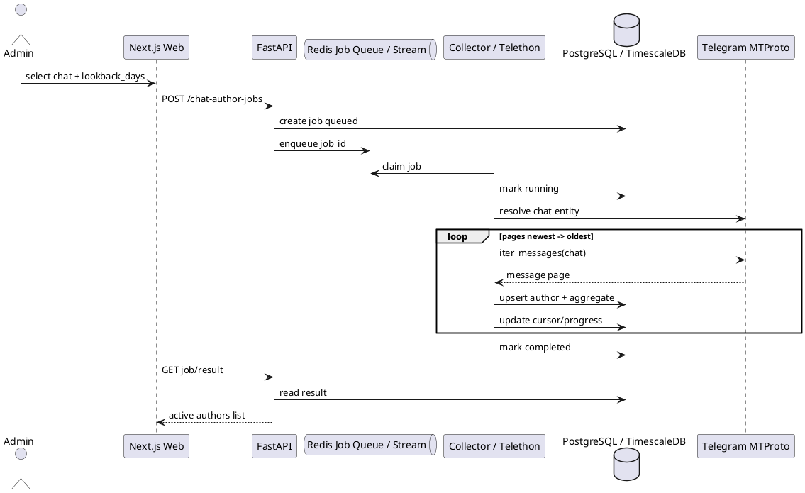

# SPEC-1-telegram-chat-active-authors

## Background

Проект уже отслеживает Telegram presence activity через Collector на Python + Telethon, сохраняет события/сессии в PostgreSQL/TimescaleDB, отдаёт аналитику через FastAPI и показывает её в Next.js dashboard.

Новая возможность: для выбранного Telegram-чата собирать не весь список участников, а список **авторов сообщений за заданный период**, например за последние 30 дней или меньше. Это снижает количество MTProto-запросов, уменьшает риск flood limits и лучше соответствует принципу минимизации данных.

Важное ограничение: нельзя гарантировать “абсолютную безопасность” аккаунта userbot-а. Можно спроектировать режим с минимальным риском: только чаты, к которым аккаунт уже имеет легальный доступ; чтение истории малыми порциями; строгий rate limiting; остановка при FLOOD_WAIT; аудит всех сборов; без обхода лимитов Telegram.

## Requirements

### Must Have

- Система должна позволять добавить Telegram chat/source для анализа по `chat_id` или `username`, если userbot уже имеет доступ к чату.
- MVP не должен автоматически вступать в чаты. Аккаунт должен быть добавлен в чат заранее вручную оператором.
- Система должна собирать **только авторов сообщений**, а не полный список участников чата.
- Период сбора должен быть настраиваемым: например `1`, `3`, `7`, `14`, `30` дней.
- Максимальный период должен ограничиваться конфигом `CHAT_AUTHORS_MAX_LOOKBACK_DAYS`, по умолчанию `30`.
- Значение периода на уровне API не может быть больше `CHAT_AUTHORS_MAX_LOOKBACK_DAYS`.
- Система не должна сохранять полный текст сообщений для этой фичи.
- Система должна сохранять минимальный профиль автора: `telegram_user_id`, `access_hash` при наличии, `username`, `first_name`, `last_name`, `is_bot`, `first_seen_at`, `last_seen_at`.
- Система должна сохранять активность автора в чате: `chat_id`, `telegram_user_id`, `period_start`, `period_end`, `message_count`, `first_message_at`, `last_message_at`.
- Collector должен читать историю постранично и останавливаться при достижении сообщения старше `period_start`.
- Collector должен иметь global и per-chat rate limiter для MTProto history-запросов.
- При `FLOOD_WAIT` система должна не обходить лимит, а ставить задачу на паузу до указанного Telegram времени.
- API должен показывать статус job: `queued`, `running`, `paused_flood_wait`, `completed`, `failed`, `cancelled`.
- Web dashboard должен позволять выбрать чат, период и запустить сбор активных авторов.
- Система должна вести audit log: кто запустил сбор, для какого чата, на какой период, когда завершилось, сколько авторов найдено.

### Should Have

- Поддержка инкрементального режима: после первичного backfill за выбранный период дальше слушать новые сообщения через updates и обновлять авторов почти в реальном времени.
- Дедупликация авторов между чатами по `telegram_user_id`.
- Настраиваемые лимиты: максимальное число сообщений на job, пауза между запросами, лимит параллельных jobs.
- Экспорт CSV/JSON найденных активных авторов.
- UI-предупреждение, что сбор должен использоваться только для чатов, где у оператора есть право на доступ и обработку данных.

### Could Have

- Распределение активности авторов по дням/часам без хранения текста сообщений.
- Фильтры по username, bot/non-bot, количеству сообщений, первому/последнему появлению.
- Автоматическое обновление списка активных авторов по расписанию, например раз в сутки.
- Поддержка нескольких collector-аккаунтов с явным разделением лимитов и ownership.

### Won’t Have / Out of Scope for MVP

- Обход Telegram flood limits, антибан-эвейжн, скрытие автоматизации или массовое сканирование чужих чатов.
- Сбор полного списка участников чата через participants scraping как основная стратегия.
- Сохранение текста сообщений, медиа, телефонов, приватных данных профиля.
- Автоматическое вступление в чаты без явного действия оператора.
- Деанонимизация пользователей или попытка связать Telegram ID с внешними источниками.

## Method

### Existing reference products

Похожие продукты, например Combot и TGStat, строят аналитику Telegram-групп/каналов вокруг активности, сообщений и статистики. Для MVP берём похожую идею “активные авторы и счётчики”, но не копируем full community-management функциональность и не сохраняем содержимое сообщений.

### Core idea

Добавить отдельный pipeline: **Chat Active Authors Collector**.

Он работает отдельно от presence tracking:

1. API создаёт `chat_author_collection_job` с выбранным `lookback_days`.
2. Collector берёт job из очереди.
3. Collector резолвит чат через Telethon.
4. Collector читает историю сообщений от новых к старым.
5. Для каждого сообщения берётся только `sender_id` и дата.
6. Когда сообщение старше `period_start`, job останавливается.
7. В PostgreSQL сохраняются авторы, агрегат по автору в чате и технический прогресс job.
8. Текст сообщений, media и вложения игнорируются.

### Component diagram



### Database schema

#### `telegram_chats`

```sql
CREATE TABLE telegram_chats (
    id BIGSERIAL PRIMARY KEY,
    telegram_chat_id BIGINT NOT NULL UNIQUE,
    access_hash BIGINT NULL,
    username TEXT NULL,
    title TEXT NULL,
    chat_type TEXT NOT NULL, -- group | supergroup | channel | unknown
    is_active BOOLEAN NOT NULL DEFAULT TRUE,
    created_at TIMESTAMPTZ NOT NULL DEFAULT now(),
    updated_at TIMESTAMPTZ NOT NULL DEFAULT now()
);

CREATE INDEX idx_telegram_chats_username ON telegram_chats (username);
```

#### `telegram_chat_author_jobs`

```sql
CREATE TABLE telegram_chat_author_jobs (
    id UUID PRIMARY KEY,
    telegram_chat_id BIGINT NOT NULL REFERENCES telegram_chats(telegram_chat_id),
    requested_by_account_user_id BIGINT NULL,

    lookback_days INT NOT NULL,
    period_start TIMESTAMPTZ NOT NULL,
    period_end TIMESTAMPTZ NOT NULL,

    status TEXT NOT NULL, -- queued | running | paused_flood_wait | completed | failed | cancelled
    cursor_message_id BIGINT NULL,
    cursor_message_date TIMESTAMPTZ NULL,

    scanned_messages_count BIGINT NOT NULL DEFAULT 0,
    unique_authors_count BIGINT NOT NULL DEFAULT 0,

    flood_wait_until TIMESTAMPTZ NULL,
    error_code TEXT NULL,
    error_message TEXT NULL,

    created_at TIMESTAMPTZ NOT NULL DEFAULT now(),
    started_at TIMESTAMPTZ NULL,
    finished_at TIMESTAMPTZ NULL,
    updated_at TIMESTAMPTZ NOT NULL DEFAULT now(),

    CONSTRAINT chk_lookback_days_positive CHECK (lookback_days >= 1)
);

CREATE INDEX idx_chat_author_jobs_status ON telegram_chat_author_jobs (status);
CREATE INDEX idx_chat_author_jobs_chat_time ON telegram_chat_author_jobs (telegram_chat_id, created_at DESC);
```

#### `telegram_users`

Можно переиспользовать существующую таблицу tracked users, если она уже хранит Telegram-профили. Если текущая `tracked_users` семантически означает “пользователь под presence monitoring”, лучше добавить отдельную таблицу:

```sql
CREATE TABLE telegram_users (
    telegram_user_id BIGINT PRIMARY KEY,
    access_hash BIGINT NULL,
    username TEXT NULL,
    first_name TEXT NULL,
    last_name TEXT NULL,
    is_bot BOOLEAN NULL,
    first_seen_at TIMESTAMPTZ NOT NULL DEFAULT now(),
    last_seen_at TIMESTAMPTZ NOT NULL DEFAULT now(),
    updated_at TIMESTAMPTZ NOT NULL DEFAULT now()
);

CREATE INDEX idx_telegram_users_username ON telegram_users (username);
```

#### `telegram_chat_active_authors`

```sql
CREATE TABLE telegram_chat_active_authors (
    id BIGSERIAL PRIMARY KEY,
    telegram_chat_id BIGINT NOT NULL REFERENCES telegram_chats(telegram_chat_id),
    telegram_user_id BIGINT NOT NULL REFERENCES telegram_users(telegram_user_id),

    period_start TIMESTAMPTZ NOT NULL,
    period_end TIMESTAMPTZ NOT NULL,

    message_count BIGINT NOT NULL DEFAULT 0,
    first_message_at TIMESTAMPTZ NOT NULL,
    last_message_at TIMESTAMPTZ NOT NULL,

    source_job_id UUID NOT NULL REFERENCES telegram_chat_author_jobs(id),
    created_at TIMESTAMPTZ NOT NULL DEFAULT now(),
    updated_at TIMESTAMPTZ NOT NULL DEFAULT now(),

    UNIQUE (telegram_chat_id, telegram_user_id, period_start, period_end)
);

CREATE INDEX idx_active_authors_chat_period ON telegram_chat_active_authors (
    telegram_chat_id,
    period_start,
    period_end
);

CREATE INDEX idx_active_authors_user ON telegram_chat_active_authors (telegram_user_id);
CREATE INDEX idx_active_authors_message_count ON telegram_chat_active_authors (message_count DESC);
```

#### `telegram_chat_author_daily_stats` optional for later

```sql
CREATE TABLE telegram_chat_author_daily_stats (
    telegram_chat_id BIGINT NOT NULL,
    telegram_user_id BIGINT NOT NULL,
    day DATE NOT NULL,
    message_count BIGINT NOT NULL DEFAULT 0,
    first_message_at TIMESTAMPTZ NULL,
    last_message_at TIMESTAMPTZ NULL,
    PRIMARY KEY (telegram_chat_id, telegram_user_id, day)
);
```

### Collector algorithm

MVP algorithm reads messages newest-to-oldest and stops as soon as it crosses the configured period boundary.

```python
async def collect_active_authors(job_id: UUID) -> None:
    job = await repo.get_job_for_update(job_id)
    config_max_days = settings.CHAT_AUTHORS_MAX_LOOKBACK_DAYS

    if job.lookback_days < 1 or job.lookback_days > config_max_days:
        await repo.fail_job(job_id, "INVALID_LOOKBACK_DAYS")
        return

    period_end = utcnow()
    period_start = period_end - timedelta(days=job.lookback_days)

    await repo.mark_running(job_id, period_start, period_end)

    try:
        entity = await telethon_client.get_entity(job.telegram_chat_id)

        async for msg in telethon_client.iter_messages(
            entity,
            limit=settings.CHAT_AUTHORS_MAX_MESSAGES_PER_JOB,
            wait_time=settings.CHAT_AUTHORS_HISTORY_WAIT_SECONDS,
        ):
            if msg.date is None:
                continue

            msg_date = ensure_utc(msg.date)

            if msg_date < period_start:
                break

            if msg.sender_id is None:
                continue

            # Do not store msg.text or media.
            sender = await msg.get_sender()

            await repo.upsert_telegram_user(
                telegram_user_id=msg.sender_id,
                access_hash=getattr(sender, "access_hash", None),
                username=getattr(sender, "username", None),
                first_name=getattr(sender, "first_name", None),
                last_name=getattr(sender, "last_name", None),
                is_bot=getattr(sender, "bot", None),
                seen_at=msg_date,
            )

            await repo.upsert_chat_active_author(
                chat_id=job.telegram_chat_id,
                telegram_user_id=msg.sender_id,
                period_start=period_start,
                period_end=period_end,
                message_at=msg_date,
                source_job_id=job_id,
            )

            await repo.increment_job_progress(
                job_id=job_id,
                cursor_message_id=msg.id,
                cursor_message_date=msg_date,
            )

        await repo.mark_completed(job_id)

    except FloodWaitError as e:
        await repo.pause_for_flood_wait(
            job_id=job_id,
            flood_wait_until=utcnow() + timedelta(seconds=e.seconds),
        )
    except Exception as e:
        await repo.fail_job(job_id, "COLLECTOR_ERROR", str(e))
```

### Important implementation notes

- `lookback_days` is validated both in API and Collector.
- Default value: `30` days.
- Maximum value: `CHAT_AUTHORS_MAX_LOOKBACK_DAYS=30` by default.
- Safer production setting can be lower, for example `7` or `14`.
- One collector account should process only one history job at a time in MVP.
- Use `iter_messages` with built-in `wait_time` and additional app-level throttling.
- Do not use aggressive parallelism across chats.
- Do not retry immediately after `FLOOD_WAIT`.
- Do not store message bodies.
- Do not call `get_participants` for this MVP path.

### API endpoints

```http
POST /api/v1/telegram/chats/resolve
```

Request:

```json
{
  "chat_ref": "@some_public_group"
}
```

Response:

```json
{
  "telegram_chat_id": -1001234567890,
  "username": "some_public_group",
  "title": "Some Public Group",
  "chat_type": "supergroup"
}
```

```http
POST /api/v1/telegram/chat-author-jobs
```

Request:

```json
{
  "telegram_chat_id": -1001234567890,
  "lookback_days": 30
}
```

Response:

```json
{
  "job_id": "7a4d3b76-33bb-4e40-bd3f-cd89a19ed8af",
  "status": "queued",
  "lookback_days": 30,
  "period_start": "2026-04-10T00:00:00Z",
  "period_end": "2026-05-10T00:00:00Z"
}
```

```http
GET /api/v1/telegram/chat-author-jobs/{job_id}
```

Response:

```json
{
  "job_id": "7a4d3b76-33bb-4e40-bd3f-cd89a19ed8af",
  "status": "running",
  "scanned_messages_count": 14820,
  "unique_authors_count": 431,
  "cursor_message_date": "2026-04-26T12:42:00Z",
  "flood_wait_until": null
}
```

```http
GET /api/v1/telegram/chats/{telegram_chat_id}/active-authors?period_days=30&limit=100&offset=0
```

Response:

```json
{
  "telegram_chat_id": -1001234567890,
  "period_days": 30,
  "items": [
    {
      "telegram_user_id": 123456789,
      "username": "example_user",
      "first_name": "Example",
      "last_name": null,
      "is_bot": false,
      "message_count": 57,
      "first_message_at": "2026-04-12T10:15:00Z",
      "last_message_at": "2026-05-09T21:40:00Z"
    }
  ]
}
```

### Redis usage

Redis can be used for lightweight queueing and locking:

- `chat_author_jobs:queue` — queued job IDs.
- `chat_author_jobs:lock:{job_id}` — prevents duplicate processing.
- `chat_author_jobs:account_lock:{collector_account_id}` — one history scan per account.
- `chat_author_jobs:chat_lock:{telegram_chat_id}` — one scan per chat.
- `chat_author_jobs:flood_wait:{collector_account_id}` — global pause until flood wait expires.

For a more robust implementation, use DB-backed jobs as source of truth and Redis only as a wake-up/lock layer.

### Rate limiting policy

Recommended MVP defaults:

```env
CHAT_AUTHORS_MAX_LOOKBACK_DAYS=30
CHAT_AUTHORS_DEFAULT_LOOKBACK_DAYS=30
CHAT_AUTHORS_MAX_MESSAGES_PER_JOB=100000
CHAT_AUTHORS_HISTORY_WAIT_SECONDS=1.5
CHAT_AUTHORS_MAX_CONCURRENT_JOBS_PER_ACCOUNT=1
CHAT_AUTHORS_MAX_CONCURRENT_JOBS_GLOBAL=1
CHAT_AUTHORS_MIN_SECONDS_BETWEEN_JOBS=60
CHAT_AUTHORS_AUTO_RESUME_FLOOD_WAIT=true
```

Production-safe profile:

```env
CHAT_AUTHORS_MAX_LOOKBACK_DAYS=14
CHAT_AUTHORS_DEFAULT_LOOKBACK_DAYS=7
CHAT_AUTHORS_MAX_MESSAGES_PER_JOB=30000
CHAT_AUTHORS_HISTORY_WAIT_SECONDS=2.0
CHAT_AUTHORS_MAX_CONCURRENT_JOBS_PER_ACCOUNT=1
CHAT_AUTHORS_MAX_CONCURRENT_JOBS_GLOBAL=1
CHAT_AUTHORS_MIN_SECONDS_BETWEEN_JOBS=180
```

### Web dashboard changes

Add page or tab: `Chat Authors`.

UI fields:

- Chat reference: `@username` or known `telegram_chat_id`.
- Lookback period: dropdown `1`, `3`, `7`, `14`, `30` days.
- Button: `Resolve chat`.
- Button: `Start collection`.
- Job status panel.
- Result table: user ID, username, name, bot, message count, first message, last message.
- Export CSV/JSON button.

UI warning text:

> Use only for chats where the connected Telegram account has legitimate access. This feature collects only message authors and counters, not message text.

### Data privacy and safety controls

- Store only author identifiers and message timestamps/counters.
- Never store message text in this feature.
- Restrict access to this feature by backend auth role, for example `admin`.
- Add audit log for every scan.
- Enforce max lookback days server-side.
- Add cancellation support for long jobs.
- Respect Telegram `FLOOD_WAIT` exactly.
- Disable parallel scans by default.

### Why not collect participants directly?

For this requirement, participants list is unnecessary and riskier. The product question is: “who wrote in this chat during the selected period?” The correct source of truth is message history, not participant scraping.

This also handles cases where a user wrote during the period but later left the chat, or where the member list is hidden/restricted.


## Implementation

### Recommended branch

`feature/chat-active-authors`

### Commit plan

Для этого обновления оптимально сделать **11 коммитов**. Меньше — получится слишком крупно и рискованно для review. Больше — начнётся дробление без пользы.

#### Commit 1 — Add configuration for chat author collection

**Message:**

```bash
feat(config): add chat author collection settings
```

**Scope:**

- Добавить env-переменные:
  - `CHAT_AUTHORS_ENABLED`
  - `CHAT_AUTHORS_MAX_LOOKBACK_DAYS`
  - `CHAT_AUTHORS_DEFAULT_LOOKBACK_DAYS`
  - `CHAT_AUTHORS_MAX_MESSAGES_PER_JOB`
  - `CHAT_AUTHORS_HISTORY_WAIT_SECONDS`
  - `CHAT_AUTHORS_MAX_CONCURRENT_JOBS_GLOBAL`
  - `CHAT_AUTHORS_MIN_SECONDS_BETWEEN_JOBS`
- Добавить значения по умолчанию в backend/collector settings.
- Обновить `.env.example` / docker env templates.

**Why first:**

Фича должна быть отключаемой и лимитируемой до появления API и collector-логики.

---

#### Commit 2 — Add database schema for chat author jobs and results

**Message:**

```bash
feat(db): add chat active authors schema
```

**Scope:**

- Alembic migration для:
  - `telegram_chats`
  - `telegram_users`, если нет подходящей существующей таблицы
  - `telegram_chat_author_jobs`
  - `telegram_chat_active_authors`
- Индексы под чтение результатов по чату/периоду.
- Unique constraints для дедупликации результатов.

**Important:**

Не смешивать миграцию с API/collector-кодом. Этот коммит должен быть чисто про БД.

---

#### Commit 3 — Add SQLAlchemy models and repositories

**Message:**

```bash
feat(api): add chat author models and repositories
```

**Scope:**

- SQLAlchemy-модели для новых таблиц.
- Repository methods:
  - create chat / upsert chat
  - create collection job
  - get job by id
  - update job status
  - upsert telegram user
  - upsert active author aggregate
  - list active authors
- Unit tests на repository-level, если в проекте уже есть такой слой тестов.

**Why separate:**

API и collector потом будут использовать один и тот же data layer.

---

#### Commit 4 — Add backend API schemas and validation

**Message:**

```bash
feat(api): add chat author request and response schemas
```

**Scope:**

- Pydantic schemas:
  - `ChatResolveRequest`
  - `ChatResolveResponse`
  - `CreateChatAuthorJobRequest`
  - `ChatAuthorJobResponse`
  - `ChatActiveAuthorResponse`
- Validation:
  - `lookback_days >= 1`
  - `lookback_days <= CHAT_AUTHORS_MAX_LOOKBACK_DAYS`
  - feature flag check через `CHAT_AUTHORS_ENABLED`

**Why separate:**

До endpoints можно проверить контракты API без бизнес-логики.

---

#### Commit 5 — Add backend endpoints for jobs and results

**Message:**

```bash
feat(api): add chat author collection endpoints
```

**Scope:**

- Добавить endpoints:
  - `POST /api/v1/telegram/chats/resolve`
  - `POST /api/v1/telegram/chat-author-jobs`
  - `GET /api/v1/telegram/chat-author-jobs/{job_id}`
  - `GET /api/v1/telegram/chats/{telegram_chat_id}/active-authors`
- Создание job в статусе `queued`.
- Публикация job id в Redis queue/stream.
- Проверка auth/role, например только admin.
- API tests.

**Important:**

На этом этапе collector ещё может не обрабатывать job. Endpoint уже должен корректно создавать задачи.

---

#### Commit 6 — Add collector job consumer skeleton

**Message:**

```bash
feat(collector): add chat author job worker skeleton
```

**Scope:**

- Добавить отдельный worker/module в collector.
- Чтение job id из Redis.
- DB lock / Redis lock, чтобы job не обрабатывался дважды.
- Статусы:
  - `queued -> running`
  - `running -> completed`
  - `running -> failed`
- Пока без реального чтения Telegram history.
- Логи job lifecycle.

**Why separate:**

Позволяет проверить orchestration без риска Telegram-запросов.

---

#### Commit 7 — Implement Telethon chat resolve and safe history scanning

**Message:**

```bash
feat(collector): collect active message authors from chat history
```

**Scope:**

- Resolve chat entity через Telethon.
- Читать сообщения через `iter_messages` от новых к старым.
- Останавливаться при `msg.date < period_start`.
- Брать только:
  - `sender_id`
  - `msg.date`
  - минимальные поля sender profile
- Не сохранять:
  - message text
  - media
  - reactions
  - forwards content
- Upsert author profile.
- Upsert aggregate по автору.
- Обновлять progress job.

**Important:**

Это основной бизнес-коммит. Он должен быть reviewable отдельно.

---

#### Commit 8 — Add flood-wait handling and rate limits

**Message:**

```bash
feat(collector): add flood wait handling for chat author scans
```

**Scope:**

- Catch `FloodWaitError`.
- Переводить job в `paused_flood_wait`.
- Сохранять `flood_wait_until`.
- Не делать immediate retry.
- Добавить global lock/concurrency limit.
- Добавить задержку между history requests/jobs.
- Автоматически возвращать job в queue после истечения flood wait, если включено конфигом.

**Why separate:**

Safety-механика должна ревьюиться отдельно от бизнес-логики сбора.

---

#### Commit 9 — Add dashboard page for chat active authors

**Message:**

```bash
feat(web): add chat active authors dashboard
```

**Scope:**

- Страница/таб `Chat Authors`.
- Поле `chat_ref` или выбор существующего `telegram_chat_id`.
- Dropdown периода: `1`, `3`, `7`, `14`, `30` дней, но не выше backend max.
- Кнопки:
  - resolve chat
  - start collection
  - refresh job status
- Таблица результатов:
  - user id
  - username
  - first/last name
  - bot flag
  - message count
  - first message
  - last message
- Safety warning в UI.

**Important:**

UI должен нормально показывать `paused_flood_wait`, а не считать это ошибкой.

---

#### Commit 10 — Add export for active authors

**Message:**

```bash
feat(api): add active authors export
```

**Scope:**

- CSV/JSON export endpoint для результатов.
- Использовать уже существующий export pattern проекта, если он есть.
- Экспортировать только агрегированные данные, без сообщений.
- Добавить кнопку export в web.

**Why after UI:**

Экспорт не нужен для проверки базового потока, но полезен как отдельное завершение feature set.

---

#### Commit 11 — Add docs, tests, and docker compose wiring

**Message:**

```bash
chore(chat-authors): add docs tests and compose wiring
```

**Scope:**

- Обновить README / ops docs.
- Описать env-переменные.
- Описать safe usage policy.
- Добавить docker-compose env wiring для `api` и `collector`.
- Добавить integration smoke test, если есть инфраструктура тестов.
- Проверить, что фича выключается через `CHAT_AUTHORS_ENABLED=false`.

**Why last:**

Финальный стабилизирующий коммит: документация, compose, smoke checks.

## Milestones

### Milestone 1 — Storage and API contract

Includes commits:

- Commit 1
- Commit 2
- Commit 3
- Commit 4
- Commit 5

**Result:**

Backend умеет создавать job, валидировать период, хранить задачи и отдавать пустые/готовые результаты. Collector ещё не обязан собирать данные.

### Milestone 2 — Collector MVP

Includes commits:

- Commit 6
- Commit 7
- Commit 8

**Result:**

Collector умеет безопасно обработать job, пройтись по истории чата за выбранный период, собрать только авторов сообщений и корректно остановиться при flood wait.

### Milestone 3 — Product UI and export

Includes commits:

- Commit 9
- Commit 10

**Result:**

Пользователь может запустить сбор из dashboard, увидеть статус job, посмотреть список активных авторов и экспортировать результат.

### Milestone 4 — Production readiness

Includes commits:

- Commit 11

**Result:**

Фича документирована, подключена в compose/env, имеет базовые тесты и может быть включена/выключена без влияния на основной presence tracking.
